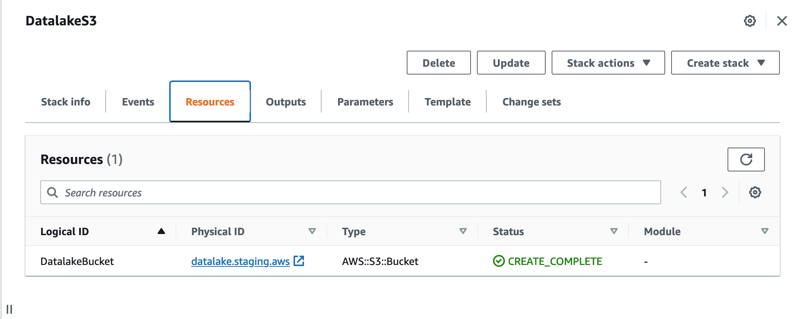
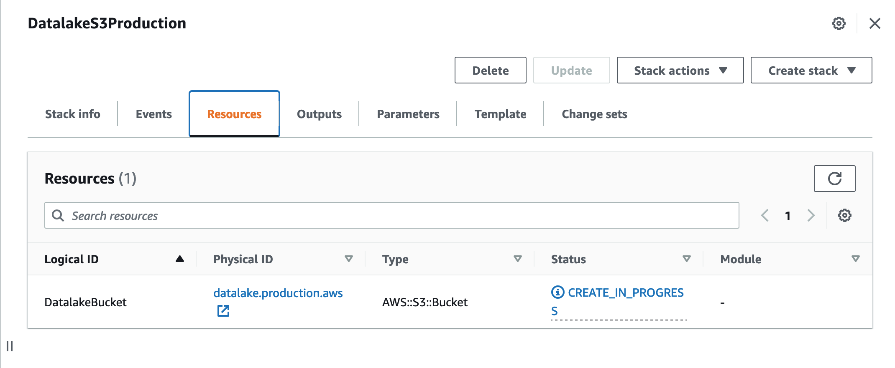
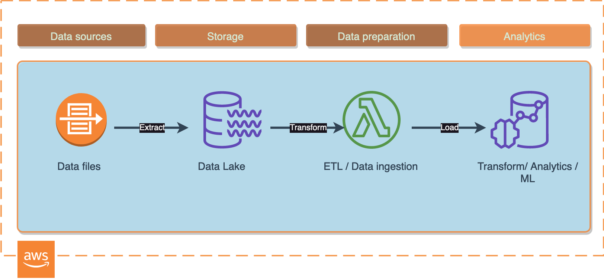
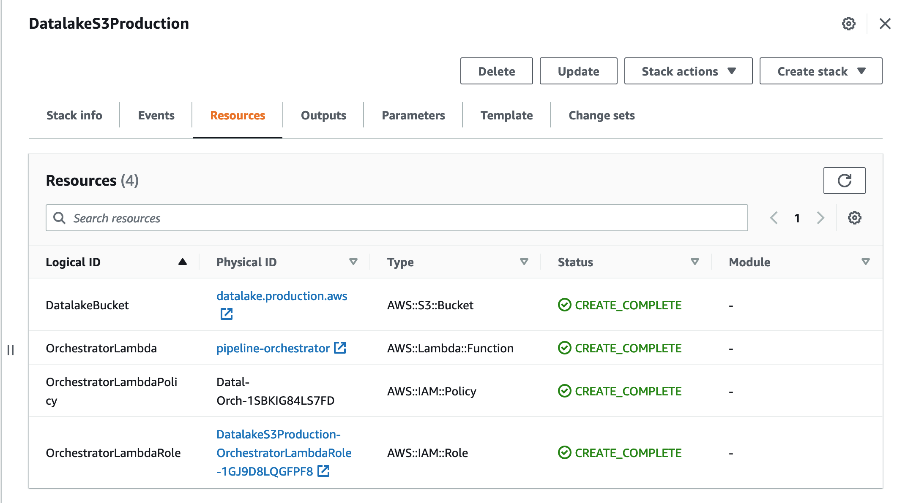

# Infrastructure as Code for your Data Pipelines
## Advanced cheat sheet for beginners
 
> Consider this article as a user-friendly introduction to Infrastructure as Code with a collection of stack file samples to deploy resources that your data platform might need.
 
I will try to cover the most common fallbacks I faced when I was trying to deploy data stack resources with **Infrastructure as code**. I will explain how to create, update, manage and import things like data lake buckets, databases, streams and data processing pipeline microservices. You will find the link to the Github repository at the bottom.
 
 
**Infrastructure as code** is becoming an increasingly popular approach for managing data platform resources. Among software engineers it is pretty much standard these days, and *it definitely looks great on your CV!*
 
> So why not deploy your data stack with code?
 
Infrastructure as code is a fantastic strategy to **create and manage** new cloud resources, i.e. cloud storage buckets or event streams, as well as for streamlining data engineering processes, including CI/CD pipelines.
 
Take a look at this code snippet below.
 
> It's a very simple S3 configuration for a data lake bucket.
 
```yaml
AWSTemplateFormatVersion: '2010-09-09'
Description: AWS S3 data lake stack.
Parameters:
 
 SourceDataBucketName:
   Description: Data lake bucket with source data files.
   Type: String
   Default: datalake.staging.aws
 
Resources:
 
 DatalakeBucket:
   Type: AWS::S3::Bucket
   DeletionPolicy: Retain
   Properties:
     BucketName:
       Ref: SourceDataBucketName
     PublicAccessBlockConfiguration:
       BlockPublicAcls: true
       IgnorePublicAcls: true
       BlockPublicPolicy: true
       RestrictPublicBuckets: true
```
 
Long story short, with just one file where you `stack` and describe your resources, you can create and change all infrastructure required data lake storage buckets, cloud functions, event streams, alarms, logging, databases and much more.
 
That's why I like it, it simplifies and automates provisioning, can be connected to *Github* and helps to model data platform resources consistently and very quickly.
 
Personally, I'm a big fan of command line, `bash` scripts and automated deployments, so
 
> if you would like to learn a few easy tricks on how to create new data pipelines with AWS Cloudformation, this article is for you.
 
Of course, there is *Terraform* and many others but I am going to cover *AWS Cloudformation* in this article. **It is used by many serious companies, and it definitely won't harm you if you know how to use it.**
 
Create a new folder for your stack:
```sh
mkdir stack
cd stack
 
```
 
If you have AWS CLI installed you can run this command and it will create the bucket with required setting for your data lake:
```sh
aws \
cloudformation deploy \
--template-file simple_stack.yaml \
--stack-name DatalakeS3 \
--capabilities CAPABILITY_IAM
```
 
Your terminal output should be something like this:
```sh
cloudformation deploy \
--template-file simple_stack.yaml \
--stack-name DatalakeS3 \
--capabilities CAPABILITY_IAM
 
Waiting for changeset to be created..
Waiting for stack create/update to complete
Successfully created/updated stack - DatalakeS3
```
If you go to AWS Console -> Cloudformation, you will find your new stack there:
 

 
## Working with parameters in stack files
 
> Parameters are useful.
 
Depending on the case (or on environment) you might want to use **the same** `stack` file but name resources differently.
Here we can add a parameter:
```yaml
Parameters:
 
 SourceDataBucketName:
   Description: Data lake bucket with source data files.
   Type: String
   Default: datalake.staging.aws
```
 
Let's imagine we want to deploy a `production` data lake S3 bucket:
 
```sh
aws \
cloudformation deploy \
--template-file simple_stack.yaml \
--stack-name DatalakeS3Production \
--capabilities CAPABILITY_IAM \
--parameter-overrides \
       SourceDataBucketName="datalake.production.aws"
```
 

 
> Alternatively, you can supply parameters from a json file
 
Create a json file like so:
```json
[
  {
    "ParameterValue": "datalake.production.aws",
    "ParameterKey": "SourceDataBucketName"
  } 
]
```
 
Your folder structure will be this:
 
```sh
.
├── production.json
└── simple_stack.yaml
```
 
Run this in command line to deploy:
 
```sh
aws \
cloudformation deploy \
--template-file simple_stack.yaml \
--stack-name DatalakeS3Production \
--capabilities CAPABILITY_IAM \
--parameter-overrides file://production.json
```
 
 
## Let's Tidy up
We might want to delete the stacks and S3 buckets we created.
 
**Delete a stack**
```sh
aws --profile mds cloudformation delete-stack --stack-name DatalakeS3Production
```
So we deleted the stack but we have `DeletionPolicy: Retain` on our data lake bucket. it will remain intact.
 
**Delete S3 bucket**
 
```sh
aws --profile mds s3 rb s3://datalake.production.aws/
```
 
However, to delete a **bucket** you will need to *recursively delete all contents* first.
 
>Sometimes you might want to keep the bucket but remove all contents.
 
To do so we can use --exclude with an empty match string.
```sh
$ aws --profile mds s3 rm s3://datalake.production.aws/ --recursive --exclude ""
```
 
 
## Adding a micro service to a stack
 
Let's imagine we have a simple micro service built with **AWS Lambda** to orchestrate data pipelines or to trigger data loading / quality checks / transformation, etc.
 

 
So in this case should you wish NOT to use **infrastructure as code** you would have to deploy the Lambda either using AWS Web Console or using AWS CLI commands. That would require to create a **Lambda security role first**, then create a **security policy** with a certain set of permissions for the Lambda, and, finally, attach it to a Lambda.
 
*It seems like a long way to go if we need to replicate the service in another environment or anywhere else.*
 
> Alternatively, we could use AWS Cloudformation. It saves time and automates deployment:
 
We can add our Lambda and all associated resource just like that:
 
```yaml
AWSTemplateFormatVersion: '2010-09-09'
Description: AWS S3 data lake stack.
Parameters:
 
 SourceDataBucketName:
   Description: Data lake bucket with source data files.
   Type: String
   Default: datalake.staging.aws
 
Resources:
 
 DatalakeBucket:
   Type: AWS::S3::Bucket
   DeletionPolicy: Retain
   Properties:
     BucketName:
       Ref: SourceDataBucketName
     PublicAccessBlockConfiguration:
       BlockPublicAcls: true
       IgnorePublicAcls: true
       BlockPublicPolicy: true
       RestrictPublicBuckets: true
 
 #### Data pipeline orchestrator ####
 OrchestratorLambda:
   Type: AWS::Lambda::Function
   DeletionPolicy: Delete
   DependsOn: OrchestratorLambdaPloicy
   Properties:
     FunctionName: pipeline-orchestrator
     Handler: pipeline_orchestrator/app.lambda_handler
     Description: Microservice that orchestrates ETL and data loading from AWS S3 to data warehouse.
     Environment:
       Variables:
         DEBUG: true
     Role: !GetAtt OrchestratorLambdaRole.Arn #arn:aws:iam::868393081606:role/my-lambda-role
     Code:
       S3Bucket: orchestrator-lambda.code.aws
       S3Key: pipeline_orchestrator/stack.zip
       # S3Key:
       #   Ref: StackPackageS3Key
     Runtime: python3.8
     Timeout: 300
     MemorySize: 128
 
 # we will need a security role to create a Lambda
 OrchestratorLambdaRole:
   Type: AWS::IAM::Role
   Properties:
     AssumeRolePolicyDocument:
       Version: "2012-10-17"
       Statement:
         -
           Effect: Allow
           Principal:
             Service:
               - "lambda.amazonaws.com"
           Action:
             - "sts:AssumeRole"
 
 OrchestratorLambdaPolicy:
   Type: AWS::IAM::Policy
   DependsOn: OrchestratorLambdaRole
   Properties:
     Roles:
       - !Ref LambdaRole
     PolicyName: 'pipeline-orchestrator-lambda-policy'
     PolicyDocument:
       {
         "Version": "2012-10-17",
           "Statement": [
               {
                   "Sid": "",
                   "Effect": "Allow",
                   "Action": "s3:*",
                   "Resource": "*"
               },
               {
                 "Effect": "Allow",
                 "Action": [
                   "lambda:*"
                 ],
                 "Resource": [
                   "*"
                 ]
               }
           ]
       }
 
```
 
## Package the service and deploy
 
Now before we deploy the updated stack we would need to package our **Orchestrator** Lambda code and upload it to S3. Run this shell commands to create a bucket for code, zip Lambda contents, upload and finally, deploy the updated stack:
 
```sh
PROFILE=mds # change to your_aws_profile or remove --profile from the following commands
STACK_NAME=DatalakeS3Production
base=${PWD##*/}
zp="stack.zip"
echo $zp
rm -f $zp
zip -r $zp * -x deploy.sh
 
# 1. Create S3 bucket for Lambda code
aws --profile $PROFILE s3 mb s3://orchestrator-lambda.code.aws
# 2. Copy the package
aws --profile $PROFILE s3 cp ./${zp} s3://orchestrator-lambda.code.aws/pipeline_orchestrator/${zp}
# 3. Deploy
aws --profile $PROFILE \
cloudformation deploy \
--template-file simple_stack_with_lambda.yaml \
--stack-name $STACK_NAME \
--capabilities CAPABILITY_IAM \
--parameter-overrides file://production.json
 
# use this if you are using stack.zip (not a unique name each time) and cloudformation deploy
# otherwise, aws will see no changes and code won't propagate.
aws --profile mds lambda update-function-code  \
   --function-name pipeline-orchestrator \
   --zip-file fileb://$zp;
 
```
 
In AWS console you will see that new resources have been added to a stack:
 

 
 
## Trigger the Lambda on all new objects created in S3
 
> Our data pipeline orchestrator will be invoked each time data lands in the data lake.
 
To enable this you would want to grant AWS S3 service relevant permission to **invoke** your Lambda:
 
```yaml
...
...
 ProcessingLambdaPermission:
   Type: AWS::Lambda::Permission
   Properties:
     Action: 'lambda:InvokeFunction'
     FunctionName: !Ref OrchestratorLambda
     # # or this, both will work:
     # FunctionName:
     #   Fn::GetAtt:
     #     - OrchestratorLambda
     #     - Arn
     Principal: s3.amazonaws.com
     SourceArn: !Sub 'arn:aws:s3:::${DatalakeBucket}'
     # SourceArn: arn:aws:s3:::datalake.production.aws
     SourceAccount: !Ref AWS::AccountId
...
...
 
```
 
> Keep in mind that bucket MUST exist before you deploy changes for `ProcessingLambdaPermission`
 
Otherwise you will face circular dependency error (when bucket does not exist but Permission already relies on it.).
 
**If you are deploying first time:**
1. Deploy a stack without ProcessingLambdaPermission
2. Add ProcessingLambdaPermission and deploy again
 
Alternatively, you can always split into two stacks, one for base resources that have to be created first, i.e. S3, IAM roles, and the second one - for anything else.
 
### Add NotificationConfiguration to S3 bucket
Then you would want to add a **NotificationConfiguration** to our data lake bucket. After this your AWS Lambda will be triggered by S3ObjectCreated events and we will be able use it to process files:
 
```yaml
     NotificationConfiguration:
       LambdaConfigurations:
       - Event: s3:ObjectCreated:*
         Function:
           Fn::GetAtt:
           - OrchestratorLambda
           - Arn
         # Filter:
         #   S3Key:
         #     Rules:
         #     - Name: prefix
         #       Value: source/
 
```
 
> Should you wish to limit your Lambda invocations only to a specific object *prefix* or *suffix* please feel free to use `Filter` on `S3Key`. For example, I choose to invoke my orchestrator Lambda only on files only with *source/* key in my data lake bucket.
 
 
## Invoke the service
 
Let's emulate our service work by sending some files into the data lake.
 
> Imagine it was a Firehose delivery stream with some data
 
**Create a simple CSV file:**
 
```sh
mkdir data
echo transaction_id,user_id,dt \\n101,777,2021-08-01\\n102,777,2021-08-01\\n103,777,2021-08-01\\n > data/simple_transaction.csv
aws --profile mds s3 cp ./data/simple_transaction.csv s3://datalake.production.aws/simple_transaction_from_data.csv
```
 
Now we can go to AWS console and check Lambda logs:

 
### One important thing to consider
 
Using AWS Cloudformation to deploy code changes in your AWS Lambda will require one thing to add in `stack.zip` file name.
 
> If we want to deploy code changes then package name must be unique each time. How to ensure that name is unique each time we deploy?
 
We can achieve this by using parameters in `stack.yaml`:
 
```yaml
# stack.yaml
AWSTemplateFormatVersion: '2010-09-09'
Description: AWS S3 data lake stack.
Parameters:
 
 SourceDataBucketName:
   Description: Data lake bucket with source data files.
   Type: String
   Default: datalake.staging.aws
 
 StackPackageS3Key:
   Type: String
   Default: pipeline_orchestrator/stack.zip
...
...
 
 OrchestratorLambda:
   Type: AWS::Lambda::Function
   DeletionPolicy: Delete
   DependsOn: OrchestratorLambdaPolicy
   Properties:
     FunctionName: pipeline-orchestrator
     Handler: pipeline_orchestrator/app.lambda_handler
     Description: Microservice that orchestrates ETL and data loading from AWS S3 to data warehouse.
     Environment:
       Variables:
         DEBUG: true
     Role: !GetAtt OrchestratorLambdaRole.Arn
     Code:
       S3Bucket: orchestrator-lambda.code.aws
       # S3Key: pipeline_orchestrator/stack.zip
       S3Key:
         Ref: StackPackageS3Key
     Runtime: python3.8
     Timeout: 300
     MemorySize: 128
...
...
 
 
```
 
 
Now our deploy.sh will look like this:
```sh
date
TIME=`date +"%Y%m%d%H%M%S"`
 
PROFILE=mds # change to your_aws_profile or remove --profile from the following commands
STACK_NAME=DatalakeS3Production
base=${PWD##*/}
zp="stack${TIME}.zip"
echo $zp
rm -f $zp
zip -r $zp * -x deploy.sh
 
# 1. Create S3 bucket for Lambda code
aws --profile $PROFILE s3 mb s3://orchestrator-lambda.code.aws
# 2. Copy the package
aws --profile $PROFILE s3 cp ./${zp} s3://orchestrator-lambda.code.aws/pipeline_orchestrator/${zp}
# 3. Deploy
aws --profile $PROFILE \
cloudformation deploy \
--template-file simple_stack_with_lambda.yaml \
--stack-name $STACK_NAME \
--capabilities CAPABILITY_IAM \
--parameter-overrides file://production.json \
--parameter-overrides \
       StackPackageS3Key="pipeline_orchestrator/${zp}"
 
```
 
 
You will see something like that and your changes will be applied from the new package:
```sh
upload: ./stack20230115135037.zip to s3://orchestrator-lambda.code.aws/pipeline_orchestrator/stack20230115135037.zip
 
Waiting for changeset to be created..
Waiting for stack create/update to complete
Successfully created/updated stack - DatalakeS3Production
```
 
 
 
 
## What else can we do with Infrastructure as Code?
Basically, we can deploy any other resource type with it, use parameters for **environments** and connect different stacks using outputs:
```yaml
# stack_1
...
Resources:
...
 
Outputs:
 BucketName:
   Value: !Ref SourceDataBucketName
   Description: Name of the sample Datalake Amazon S3 bucket with a lifecycle configuration.
   Export:
     Name: datalakeS3BucketName
 
```
and then import resources into another stack:
```yaml
# stack_2
Parameters:
...
    DatalakeBucket:
    ...
          Properties:
              BucketName:
                  Fn::Join:
                  - "."
                  - - "another"
                      - "stack"
                      - Fn::ImportValue: datalakeS3BucketName
...
```
This will create another bucket from stack_2.yaml using name from the stack_1.yaml.
 
 
**Depending on our Data platform architecture type**, we might want to add an archive storage bucket. Let's say our data platform is a lake house and we use Redshift as the main solution to transform data.
 
> While building a data warehouse we would want to optimise storage costs associated with data in the data lake.
 
and apply a rule: After 90 days data files go to **archive**.
 
- We could set life-cycle policy to keep only 90 days of data for the main data lake bucket, everything else should go to archive.
 
- Then you would want to create a `Glacier` type S3 bucket and replicate your main data lake bucket there after 90 days.
 
```yaml
 DatalakeBucket:
   Type: AWS::S3::Bucket
   DeletionPolicy: Retain
   Properties:
     ...
     LifecycleConfiguration:
       Rules:
       - Id: DatalakeBucketRule
         Status: Enabled
         Transitions:
         - TransitionInDays: 90
           StorageClass: GLACIER
           # Allowed values: DEEP_ARCHIVE | GLACIER | GLACIER_IR | INTELLIGENT_TIERING | ONEZONE_IA | STANDARD_IA
```
 
2. Add **outputs** to stack files. Becomes very useful when we can import resources from other stacks.
 
3. Add tags for cost monitoring, etc.
 
4. Add a LogGroup resource for your Lambda. They are created automatically with Lambda. It is considered as best practice to explicitly add it in Cloudformation template:
```yaml
...
 OrchestratorLambdaLogGroup:
   DeletionPolicy: Delete
   Type: AWS::Logs::LogGroup
   Properties:
     RetentionInDays: 7
     LogGroupName: /aws/lambda/pipeline-orchestrator
```
 
Use this to delete existing one in case you need to:
```sh
aws --profile mds logs delete-log-group --log-group-name "/aws/lambda/pipeline-orchestrator"
```
 
 
 
## Conclusion
Using AWS CloudFormation template files you can describe your required resources and their dependencies so you can launch and configure them together as a single stack.
 
If you are a **data professional** this approach can definitely help working with different data environments and replicate data platform resources faster and more consistently without errors.
 
>Using **AWS Cloudformation** stack files I create `staging` and `production` *CI/CD pipelines* with *Github Actions* and changes propagate automatically.
 
It saves time and helps to model and provision data resources more effectively.
I hope it was an easy-to-follow tutorial and felt like a user-friendly introduction to **Infrastructure as code**.
 
 
## Recommended read
 
[1. https://docs.aws.amazon.com/cli/latest/reference/cloudformation/deploy/index.html](https://docs.aws.amazon.com/cli/latest/reference/cloudformation/deploy/index.html)
 
[2. https://aws.amazon.com/premiumsupport/knowledge-center/unable-validate-circular-dependency-cloudformation/](https://aws.amazon.com/premiumsupport/knowledge-center/unable-validate-circular-dependency-cloudformation/)
 
[3. https://stackoverflow.com/questions/50158593/work-around-circular-dependency-in-aws-cloudformation](https://stackoverflow.com/questions/50158593/work-around-circular-dependency-in-aws-cloudformation)

[4. https://docs.aws.amazon.com/AWSCloudFormation/latest/UserGuide/aws-properties-s3-bucket-lifecycleconfig-rule-transition.html](https://docs.aws.amazon.com/AWSCloudFormation/latest/UserGuide/aws-properties-s3-bucket-lifecycleconfig-rule-transition.html)

